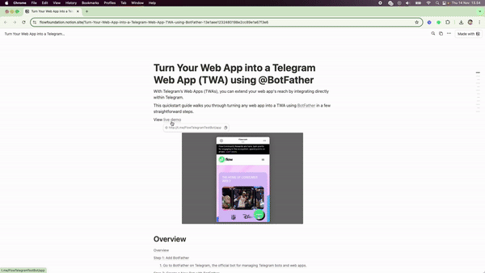
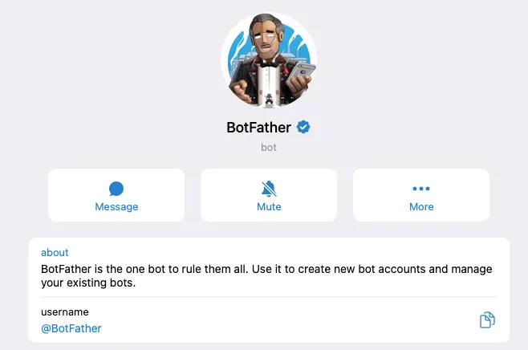
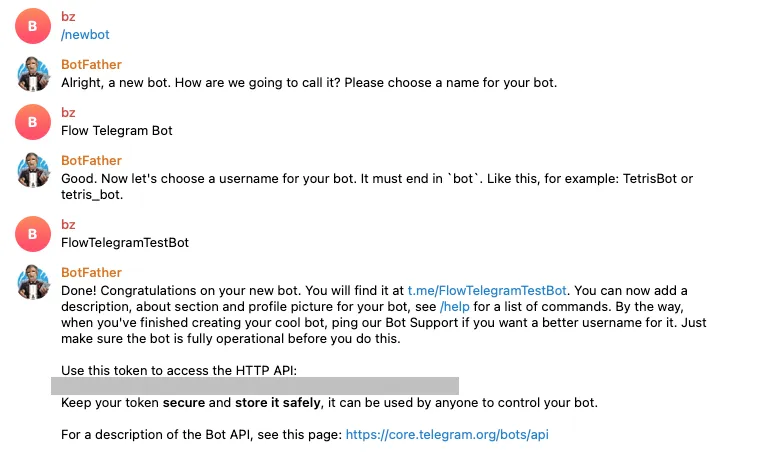
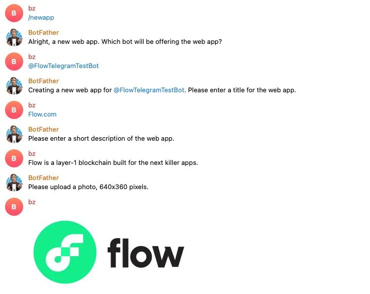
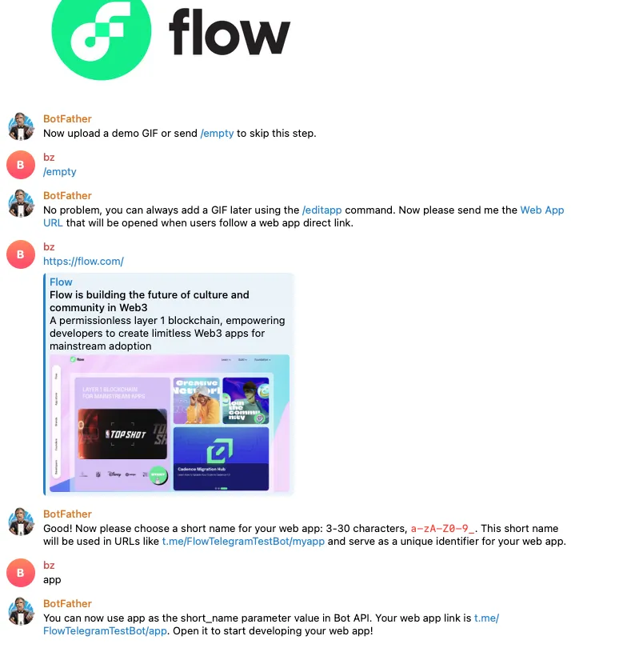
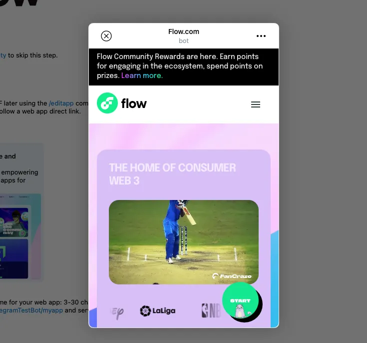

# Transforme Seu Aplicativo Web em um Aplicativo Web do Telegram (TWA) usando @BotFather

## Envie Sua Solução

-   Envie seu deeplink no README.md na [pasta de soluções](solution/README.md)

## Demonstração ao Vivo

Veja a [Demonstração ao Vivo](http://t.me/FlowTelegramTestBot/app)

Veja o [Exemplo de Solução](example/README.md)

---

Transforme qualquer Aplicativo Web em um Aplicativo Web do Telegram (TWA).

Com os Aplicativos Web do Telegram, você pode expandir o alcance do seu aplicativo web integrando-o diretamente ao Telegram.

Este guia rápido mostra como transformar qualquer aplicativo web em um TWA usando o [BotFather](https://t.me/BotFather) em alguns passos simples.

## Passo 1: Adicione o BotFather

### 1. Acesse o [BotFather no Telegram](https://t.me/BotFather), o bot oficial para gerenciar bots e aplicativos web do Telegram.

## Passo 2: Crie um Novo Bot com o BotFather

### 1. No chat com o BotFather, use o comando `/newbot` e siga as instruções para dar um nome e um nome de usuário único ao seu bot

## Passo 3: Registre um Novo Aplicativo Web

### 1. Use o comando `/newapp` para registrar seu aplicativo web.

### 2. Selecione o bot que você acabou de criar.

### 3. Forneça os seguintes detalhes:

-   **Título** – O título do seu aplicativo web.
-   **Descrição Curta** – Uma breve descrição para ajudar os usuários a entenderem o aplicativo.
-   **Foto** – Envie uma imagem (640x360 pixels) que represente seu aplicativo.
-   **GIF de Demonstração** – Opcional. Envie um GIF curto demonstrando seu aplicativo, ou use `/empty` para pular.
-   **URL do Aplicativo Web** – Digite a URL do seu aplicativo web.
-   **Nome Curto** – Escolha um identificador único para seu aplicativo, que será usado no seu deeplink.

## **Passo 4:** Acesse Seu Link TWA

### 1. Após completar os passos, você receberá um deeplink para seu Aplicativo Web do Telegram. Será algo como: [`t.me/FlowTelegramTestBot/app`](t.me/FlowTelegramTestBot/app)

## Conclusão

E é isso! Com apenas alguns passos, seu aplicativo web agora está acessível como um Aplicativo Web do Telegram, abrindo novas formas para os usuários interagirem com seu aplicativo diretamente no Telegram. Bom desenvolvimento!
