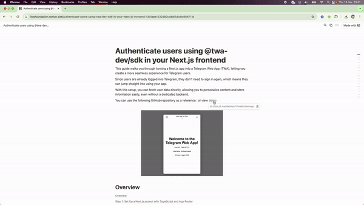
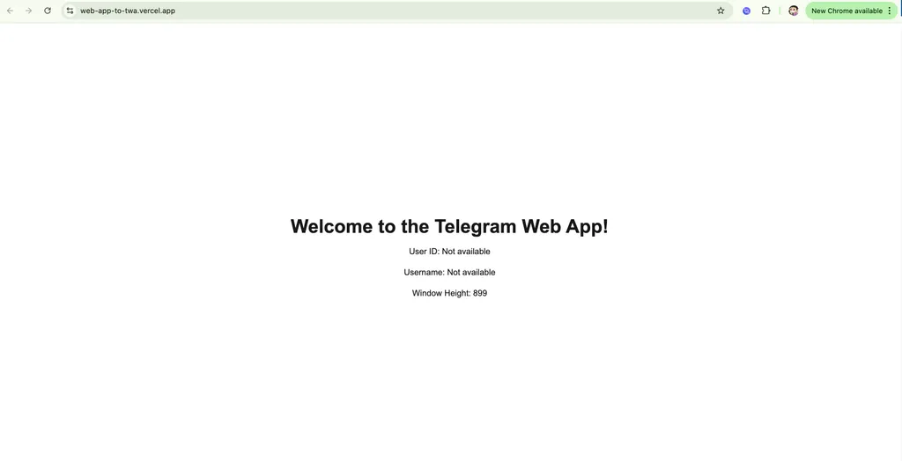
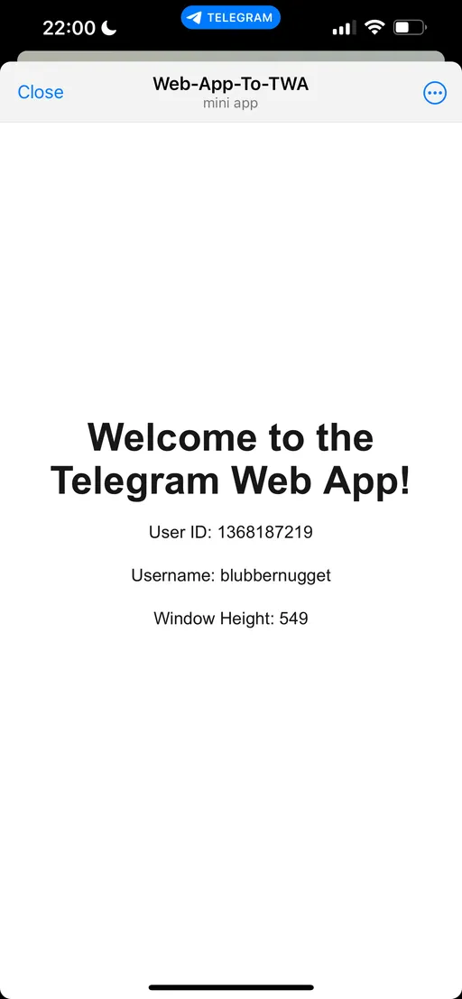

# Autentique usuários usando @twa-dev/sdk em seu frontend Next.js

## Envie Sua Solução

-   Envie seu deeplink e repositório GitHub no README.md na [pasta de soluções](solution/README.md)

## Exemplo

Veja a [Demonstração ao Vivo](https://t.me/WebAppToTwaBot/webapp)

Veja o [Código de Exemplo](example/web-app-to-twa-main/)



---

Este guia mostra como transformar um aplicativo Next.js em um Aplicativo Web do Telegram (TWA), permitindo criar uma experiência mais integrada para os usuários do Telegram.

Como os usuários já estão logados no Telegram, eles não precisam fazer login novamente, o que significa que podem começar a usar seu aplicativo imediatamente.

Com esta configuração, você pode buscar dados do usuário diretamente, permitindo personalizar conteúdo e armazenar informações facilmente, mesmo sem um backend dedicado.

## Passo 1: Configure um projeto Next.js com TypeScript e App Router

### 1. Execute o comando no seu terminal

```bash 
npx create-next-app@latest my-telegram-app --typescript --use-npm
```
​
### 2. Navegue até o Diretório do Seu Projeto

```bash 
cd my-telegram-app
```
​
### 3. Instale o @twa-dev/sdk com a flag --legacy-peer-deps

```bash 
npm install @twa-dev/sdk --legacy-peer-deps
```

## Passo 2: Configure o Contexto de Autenticação com @twa-dev/sdk

Usaremos a API de Contexto do React para gerenciar a autenticação e os dados do Aplicativo Web do Telegram, tornando-os disponíveis em todo nosso aplicativo.

### 1. Crie um `AuthContext.tsx` em uma nova pasta `context` dentro de `app`

```typescript
// app/context/AuthContext.tsx
'use client';

import React, { createContext, useContext, useEffect, useState } from 'react';
import WebApp from '@twa-dev/sdk';

type AuthContextType = {
	userID: number | null;
	username: string | null;
	windowHeight: number;
};

const AuthContext = createContext<AuthContextType | undefined>(undefined);

export const AuthContextProvider = ({
	children,
}: {
	children: React.ReactNode;
}) => {
	const [windowHeight, setWindowHeight] = useState<number>(0);
	const [userID, setUserID] = useState<number | null>(null);
	const [username, setUsername] = useState<string | null>(null);

	useEffect(() => {
		// Garante que este código só é executado no lado do cliente
		if (typeof window !== 'undefined' && WebApp) {
			WebApp.isVerticalSwipesEnabled = false;
			setWindowHeight(WebApp.viewportStableHeight || window.innerHeight);
			WebApp.ready();

			// Define os dados do usuário do Telegram
			const user = WebApp.initDataUnsafe.user;
			setUserID(user?.id || null);
			setUsername(user?.username || null);
		}
	}, []);

	const contextValue = {
		userID,
		username,
		windowHeight,
	};

	return (
		<AuthContext.Provider value={contextValue}>
			{children}
		</AuthContext.Provider>
	);
};

export const useAuth = () => {
	const context = useContext(AuthContext);
	if (context === undefined) {
		throw new Error('useAuth deve ser usado dentro de um AuthContextProvider');
	}
	return context;
};
```

## Passo 3: Envolva seu App com `AuthContextProvider`

1. Atualize o `layout.tsx` para envolver todo o aplicativo

```typescript
// app/layout.tsx
import './globals.css';
import { AuthContextProvider } from '@/context/AuthContext';

export default function RootLayout({
	children,
}: Readonly<{
	children: React.ReactNode;
}>) {
	return (
		<html lang="pt-BR">
			<body>
				<AuthContextProvider>{children}</AuthContextProvider>
			</body>
		</html>
	);
}
```

## Passo 4: Crie DisplayUser.tsx e use-o na Página Inicial

Para testar se funciona, usaremos o hook `useAuth` do `AuthContext` para acessar e exibir o ID do usuário autenticado no Telegram, nome de usuário e altura da viewport.

### 1. Crie `components/DisplayUser.tsx`

```typescript
// components/DisplayUser.tsx
'use client';

import { useAuth } from '@/context/AuthContext';

export default function DisplayUser() {
	const { userID, username, windowHeight } = useAuth();

	return (
		<div className="flex flex-col items-center justify-center min-h-screen text-center space-y-4">
			<h1 className="text-4xl font-bold">
				Bem-vindo ao Aplicativo Web do Telegram!
			</h1>
			<p>ID do Usuário: {userID || 'Não disponível'}</p>
			<p>Nome de Usuário: {username || 'Não disponível'}</p>
			<p>Altura da Janela: {windowHeight}</p>
		</div>
	);
}
```

### 2. Crie `app/page.tsx`

```typescript
// app/page.tsx
import DisplayUser from '@/components/DisplayUser';

export default function Home() {
	return (
		<div>
			<DisplayUser />
		</div>
	);
}
```

## Passo 5: Implante seu frontend na Vercel

### 1. Implante seu aplicativo Next.js na [Vercel](https://vercel.com/) (ou sua plataforma de hospedagem preferida)



## Passo 6: Crie um Bot do Telegram e Transforme seu Aplicativo Web em um TWA

### 1. Acesse o [BotFather](https://t.me/BotFather) no Telegram e crie um novo bot

```bash
/newbot
```

### 2. Use o comando `/newapp` no BotFather para transformar seu aplicativo web em um TWA

```bash
/newapp
```

### 3. Configure o domínio do seu bot para sua URL de implantação (ex: https://web-app-to-twa.vercel.app/)

Isso criará um deeplink (ex: https://t.me/WebAppToTwaBot/webapp) que você pode acessar para verificar se seu aplicativo web do telegram exibe o ID e nome de usuário do usuário



## Conclusão

Este tutorial leva você a configurar um aplicativo Next.js com TypeScript, configurar um Aplicativo Web do Telegram com @twa-dev/sdk e exibir dados do usuário autenticado do Telegram dentro do seu aplicativo.

Adicione seu deeplink ao seu Aplicativo Web do Telegram:

Adicione seu URL ao seu repositório GitHub:
