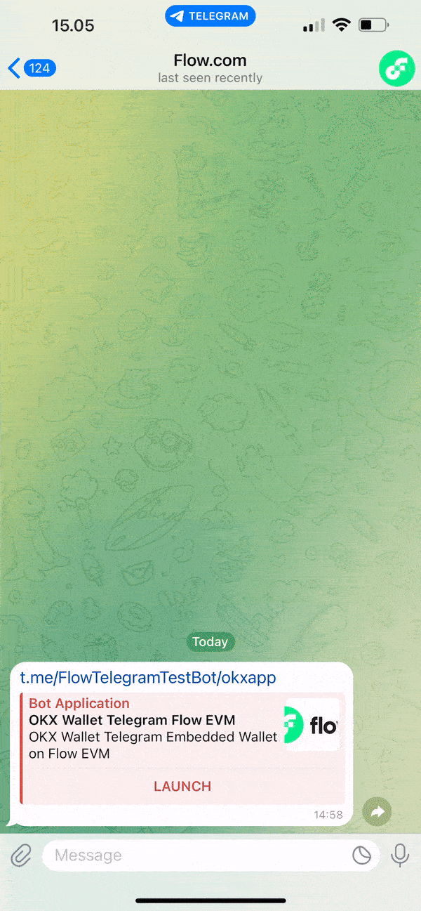
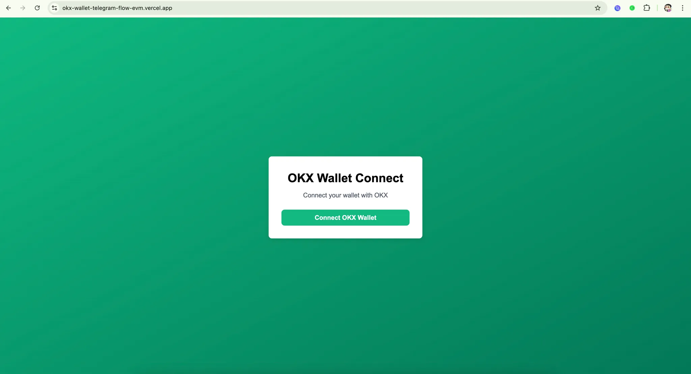
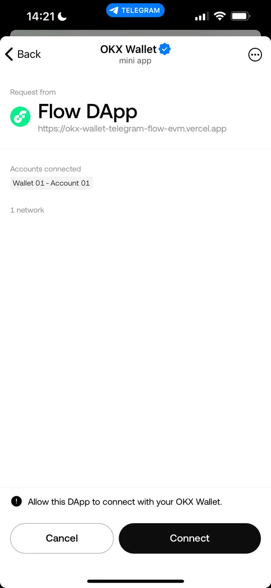

# Conecte a Carteira Integrada OKX do Telegram no Flow EVM

## Envie Sua Solução

-   Envie seu deeplink e repositório GitHub no README.md na [pasta de soluções](solution/README.md)

## Exemplo

Veja a [Demonstração ao Vivo](http://t.me/FlowTelegramTestBot/okxapp)

Veja o [Código de Exemplo](example/okx-wallet-telegram-flow-evm-main/)



---

Este guia aborda a conexão de uma carteira OKX como carteira integrada do Telegram no Flow EVM

Flow é uma blockchain de camada 1 com dois ambientes: Flow EVM e Flow Cadence. Este guia é especificamente para **Flow EVM**.

## Passo 1: Configure um projeto Next.js com TypeScript e App Router

### 1. Execute o comando no seu terminal

```bash
npx create-next-app@latest my-app --typescript
```

### 2. Navegue até o Diretório do Seu Projeto

```bash
cd my-app
```

### 3. Instale @okxconnect/ui

```bash
npm install @okxconnect/ui
```

# Passo 2: Crie `AuthContext.tsx`

Crie a pasta `context` e `AuthContext.tsx` para fornecer dados de autenticação aos componentes em todo o aplicativo:

```tsx
// context/AuthContext.tsx
'use client';

import React, { createContext, useContext, useState, useEffect } from 'react';
import { OKXUniversalConnectUI, THEME } from '@okxconnect/ui';

interface AuthContextType {
	connected: boolean;
	walletAddress: string | null;
	chainId: string | null;
	logIn: () => Promise<void>;
	logOut: () => Promise<void>;
}

const AuthContext = createContext<AuthContextType | undefined>(undefined);

export const AuthContextProvider: React.FC<{ children: React.ReactNode }> = ({
	children,
}) => {
	const [client, setClient] = useState<OKXUniversalConnectUI | null>(null);
	const [walletAddress, setWalletAddress] = useState<string | null>(null);
	const [chainId, setChainId] = useState<string | null>(null);
	const [connected, setConnected] = useState(false);

	useEffect(() => {
		const initClient = async () => {
			try {
				const uiClient = await OKXUniversalConnectUI.init({
					dappMetaData: {
						name: 'Flow DApp',
						icon: 'https://cryptologos.cc/logos/flow-flow-logo.png',
					},
					actionsConfiguration: {
						returnStrategy: 'none', // Ou 'tg://resolve'
						modals: 'all',
					},
					uiPreferences: {
						theme: THEME.LIGHT,
					},
				});
				setClient(uiClient);
			} catch (error) {
				console.error('Falha ao inicializar OKX UI:', error);
			}
		};
		initClient();
	}, []);

	const logIn = async () => {
		if (!client) return;
		try {
			const session = await client.openModal({
				namespaces: {
					eip155: {
						chains: ['eip155:747'],
						defaultChain: '747',
					},
				},
			});

			// Garante que a sessão está definida
			if (!session || !session.namespaces.eip155) {
				console.error('Sessão indefinida ou inválida');
				return;
			}

			const address =
				session.namespaces.eip155.accounts[0]?.split(':')[2];

			// Remove o prefixo "eip155:" do chainId
			const rawChainId = session.namespaces.eip155.chains[0];
			const chain = rawChainId?.split(':')[1] || null;

			setWalletAddress(address);
			setChainId(chain);
			setConnected(true);
		} catch (error) {
			console.error('Falha ao conectar carteira:', error);
		}
	};

	const logOut = async () => {
		if (!client) return;
		try {
			await client.disconnect();
			setWalletAddress(null);
			setChainId(null);
			setConnected(false);
		} catch (error) {
			console.error('Falha ao desconectar carteira:', error);
		}
	};

	return (
		<AuthContext.Provider
			value={{
				connected,
				walletAddress,
				chainId,
				logIn,
				logOut,
			}}
		>
			{children}
		</AuthContext.Provider>
	);
};

export const useAuth = () => {
	const context = useContext(AuthContext);
	if (!context) {
		throw new Error('useAuth deve ser usado dentro de um AuthProvider');
	}
	return context;
};
```

# Passo 3: Integre a Autenticação no `layout.tsx`

Use `AuthContextProvider` no seu `layout.tsx` principal para tornar o contexto disponível globalmente:

```tsx
// app/layout.tsx
import './globals.css';
import { AuthContextProvider } from '@/context/AuthContext';

export default function RootLayout({
	children,
}: {
	children: React.ReactNode;
}) {
	return (
		<html lang="pt-BR">
			<body>
				<AuthContextProvider>{children}</AuthContextProvider>
			</body>
		</html>
	);
}
```

# Passo 4: Crie `WalletConnection.tsx`

Crie a pasta `components` e `WalletConnection.tsx` para adicionar botões de login e logout:

```tsx
// components/WalletConnection.tsx
'use client';

import { useAuth } from '@/context/AuthContext';

export default function WalletConnection() {
	const { connected, walletAddress, chainId, logIn, logOut } = useAuth();

	return (
		<div className="page-container">
			<div className="card">
				<h1 className="card-title">Conectar Carteira OKX</h1>

				{connected ? (
					<div>
						<p className="card-subtitle">
							Obrigado por conectar sua carteira!
						</p>
						<div className="space-y-4">
							<p className="connected-text">
								Endereço da Carteira:{' '}
								{walletAddress && (
									<span className="connected-username">
										{walletAddress}
									</span>
								)}
							</p>
							{chainId && (
								<p className="connected-text">
									ID da Chain:{' '}
									<span className="connected-username">
										{chainId}
									</span>
								</p>
							)}
							<button
								onClick={logOut}
								className="button button-disconnect"
							>
								Desconectar Carteira
							</button>
						</div>
					</div>
				) : (
					<div>
						<p className="card-subtitle">
							Conecte sua carteira com OKX
						</p>
						<button
							onClick={logIn}
							className="button button-connect"
						>
							Conectar Carteira OKX
						</button>
					</div>
				)}
			</div>
		</div>
	);
}
```

# Passo 5: Adicione Estilos Opcionais

(Opcional) Você pode adicionar uma folha de estilos usando Tailwind CSS para estilização básica. Aqui está um exemplo de configuração do `globals.css`:

```css
/* globals.css */
@tailwind base;
@tailwind components;
@tailwind utilities;

:root {
	--background: #ffffff;
	--foreground: #171717;
}

@media (prefers-color-scheme: dark) {
	:root {
		--background: #0a0a0a;
		--foreground: #ededed;
	}
}

body {
	color: var(--foreground);
	background: var(--background);
	font-family: Arial, Helvetica, sans-serif;
}

.page-container {
	min-height: 100vh;
	display: flex;
	align-items: center;
	justify-content: center;
	background: linear-gradient(to bottom right, #10b981, #047857);
}

.card {
	background-color: #ffffff;
	border-radius: 0.5rem;
	box-shadow: 0px 4px 12px rgba(0, 0, 0, 0.1);
	padding: 2rem;
	width: 100%;
	max-width: 24rem;
}

.card-title {
	font-size: 1.875rem;
	font-weight: 700;
	text-align: center;
	margin-bottom: 0.5rem;
	color: black;
}

.card-subtitle {
	color: #4b5563;
	text-align: center;
	margin-bottom: 1.5rem;
}

.button {
	width: 100%;
	padding: 0.5rem 1rem;
	font-weight: 600;
	border-radius: 0.5rem;
	transition: background-color 0.2s ease-in-out;
	color: #ffffff;
}

.button-connect {
	background-color: #10b981;
}

.button-disconnect {
	background-color: #6b7280;
}
```

# Passo 6: Implante seu frontend na Vercel

### 1. Implante seu aplicativo Next.js na [Vercel](https://vercel.com/) (ou sua plataforma de hospedagem preferida)



# Passo 7: Transforme seu Aplicativo Web em um TWA

### 1. Acesse o [BotFather](https://t.me/BotFather) no Telegram e crie um novo bot

```bash
/newbot
```

### 2. Use o comando `/newapp` no BotFather para transformar seu aplicativo web em um TWA

```bash
/newapp
```

### 3. Configure o domínio do seu bot para sua URL de implantação

Isso criará um deeplink (ex: [t.me/FlowTelegramTestBot/okxapp](https://t.me/FlowTelegramTestBot/okxapp)) que você pode acessar pelo seu telefone para verificar se seu aplicativo web do telegram pode se conectar com a carteira integrada OKX do Telegram.



# Conclusão

Com estes passos, você pode configurar um Aplicativo Web do Telegram em Next.js que permite a conexão de carteira com a carteira integrada OKX do Telegram no Flow EVM.
