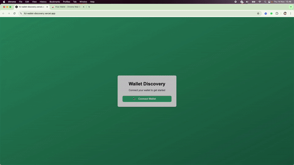
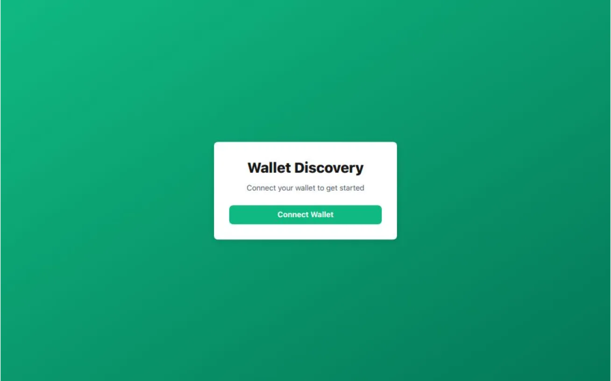

# Conecte uma Carteira na Blockchain Flow no Ambiente Cadence

## Envie Sua Solução

-   Envie seu deeplink e repositório GitHub no README.md na [pasta de soluções](solution/README.md)

## Exemplo

Veja a [Demonstração ao Vivo](https://fcl-wallet-discovery.vercel.app/)

Veja o [Código de Exemplo](example/fcl-wallet-discovery-main/)



---

Conectar uma carteira é essencial para interagir com dApps, permitindo transações seguras e acesso a recursos da blockchain. Este guia aborda a conexão de uma carteira no Flow Cadence para usar carteiras nativas do Flow, como Flow Wallet\* e Blocto.

Flow é uma blockchain de camada 1 com dois ambientes: Flow EVM e Flow Cadence. Este guia é especificamente para **Flow Cadence**.

**\*Nota:** [Flow Wallet](https://wallet.flow.com/) suporta tanto Flow EVM quanto Flow Cadence.

## Passo 1: Configure um projeto Next.js com TypeScript e App Router

### 1. Execute o comando no seu terminal

`bash npx create-next-app@latest my-app --typescript`
​

### 2. Navegue até o Diretório do Seu Projeto

`bash cd my-app`
​

### 3. Instale @onflow/fcl e @onflow/types

`bash npm install --save @onflow/fcl @onflow/types`
​
**\*Nota:** Algumas configurações podem exigir pino-pretty. Se você encontrar algum erro, execute:
`bash npm install pino-pretty --save-dev`

## Passo 2: Configure o Flow (`flow-config.ts`)

Crie um novo arquivo na raiz do seu projeto chamado `flow-config.ts`. Este arquivo conterá a configuração do Flow:

```bash
import { config } from '@onflow/fcl';

config({
	'accessNode.api': 'https://rest-mainnet.onflow.org',
	'flow.network': 'mainnet',
	'discovery.wallet': 'https://fcl-discovery.onflow.org/authn',
});
```

## Passo 3: Crie o Hook `useCurrentUser`

Crie uma pasta `hooks` na raiz e um hook personalizado chamado `use-current-user.hook.tsx` para lidar com a autenticação no Flow:

```typescript
// hooks/use-current-user.hook.tsx
'use client';

import { useEffect, useState } from 'react';
import * as fcl from '@onflow/fcl';

export default function useCurrentUser() {
	const [user, setUser] = useState({ addr: null });

	const logIn = () => {
		fcl.authenticate();
	};

	const logOut = () => {
		fcl.unauthenticate();
	};

	useEffect(() => {
		fcl.currentUser().subscribe(setUser);
	}, []);

	return [user, user?.addr != null, logIn, logOut];
}
```

## Passo 4: Configure o `AuthContext.tsx`

Crie a pasta `context` e `AuthContext.tsx` para fornecer dados de autenticação aos componentes em todo o aplicativo:

```typescript
// context/AuthContext.tsx
'use client';

import React, { createContext, useContext } from 'react';
import useCurrentUser from '@/hooks/use-current-user.hook';

interface AuthContextType {
	user: any;
	loggedIn: any;
	logIn: any;
	logOut: any;
}

const AuthContext = createContext<AuthContextType | undefined>(undefined);

export const AuthContextProvider: React.FC<{ children: React.ReactNode }> = ({
	children,
}) => {
	const [user, loggedIn, logIn, logOut] = useCurrentUser();

	return (
		<AuthContext.Provider value={{ user, loggedIn, logIn, logOut }}>
			{children}
		</AuthContext.Provider>
	);
};

export const useAuth = () => {
	const context = useContext(AuthContext);
	if (!context) {
		throw new Error('useAuth deve ser usado dentro de um AuthContextProvider');
	}
	return context;
};
```

## Passo 5: Integre a Autenticação no `layout.tsx`

Use `AuthContextProvider` no seu `layout.tsx` principal para tornar o contexto disponível globalmente:

```typescript
// app/layout.tsx
'use client';

import './globals.css';
import { AuthContextProvider } from '@/context/AuthContext';
import '../flow-config';

export default function RootLayout({
	children,
}: {
	children: React.ReactNode;
}) {
	return (
		<html lang="pt-BR">
			<body suppressHydrationWarning={true}>
				<AuthContextProvider>{children}</AuthContextProvider>
			</body>
		</html>
	);
}
```

## Passo 6: Crie a Página com o Botão de Conectar Carteira

No seu `page.tsx` principal, você pode atualizá-lo para adicionar botões de login e logout:

```typescript
// app/page.tsx
'use client';

import { useAuth } from '@/context/AuthContext';

export default function Home() {
	const { user, loggedIn, logIn, logOut } = useAuth();

	return (
		<div className="page-container">
			<div className="card">
				<h1 className="card-title">Descoberta de Carteira</h1>
				<p className="card-subtitle">
					Conecte sua carteira para começar
				</p>

				{loggedIn ? (
					<div className="space-y-4">
						<p className="connected-text">
							Conectado como:{' '}
							<span className="connected-username">
								{user?.addr}
							</span>
						</p>
						<button
							onClick={logOut}
							className="button button-disconnect"
						>
							Desconectar Carteira
						</button>
					</div>
				) : (
					<button onClick={logIn} className="button button-connect">
						Conectar Carteira
					</button>
				)}
			</div>
		</div>
	);
}
```

## Passo 7: Adicione Estilos Opcionais

(Opcional) Você pode adicionar uma folha de estilos usando Tailwind CSS para estilização básica. Aqui está um exemplo de configuração do `globals.css`:

```css
/* globals.css */
@tailwind base;
@tailwind components;
@tailwind utilities;

:root {
	--background: #ffffff;
	--foreground: #171717;
}

@media (prefers-color-scheme: dark) {
	:root {
		--background: #0a0a0a;
		--foreground: #ededed;
	}
}

body {
	color: var(--foreground);
	background: var(--background);
	font-family: Arial, Helvetica, sans-serif;
}

.page-container {
	min-height: 100vh;
	display: flex;
	align-items: center;
	justify-content: center;
	background: linear-gradient(to bottom right, #10b981, #047857);
}

.card {
	background-color: #ffffff;
	border-radius: 0.5rem;
	box-shadow: 0px 4px 12px rgba(0, 0, 0, 0.1);
	padding: 2rem;
	width: 100%;
	max-width: 24rem;
}

.card-title {
	font-size: 1.875rem;
	font-weight: 700;
	text-align: center;
	margin-bottom: 0.5rem;
}

.card-subtitle {
	color: #4b5563;
	text-align: center;
	margin-bottom: 1.5rem;
}

.button {
	width: 100%;
	padding: 0.5rem 1rem;
	font-weight: 600;
	border-radius: 0.5rem;
	transition: background-color 0.2s ease-in-out;
	color: #ffffff;
}

.button-connect {
	background-color: #10b981;
}

.button-disconnect {
	background-color: #6b7280;
}
```



## Conclusão

Com estes passos, você pode configurar um aplicativo Next.js que permite a conexão de carteira na Blockchain Flow no ambiente Cadence, permitindo que os usuários se autentiquem e interajam com carteiras nativas do Flow como Flow Wallet e Blocto.
